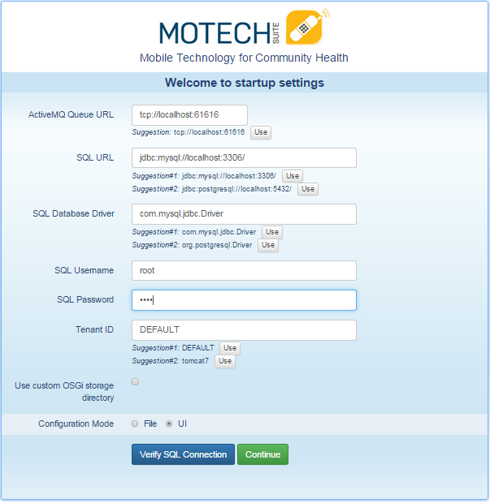
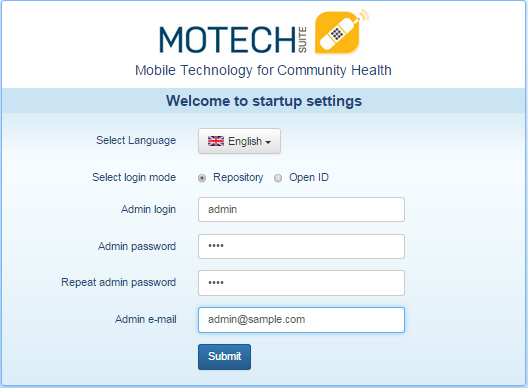

=================
Installing MOTECH
=================

This installation guide is used for demo systems based on Ubuntu 14.04 LTS. It assumes you are running on the same and is not suitable for a full production install which requires additional steps to ensure security of the system. For example, it's not advisable to use the root username in MySQL to setup the databases. MOTECH will run on other operating systems but the commands required and external packages will change. The changes shouldn’t be drastic but they aren’t documented here.

Install and Configure Dependencies
----------------------------------

	MOTECH depends on the following software:

	| Tomcat7
	| Java7 (OpenJDK or OracleJDK) *OpenJDK installs as a dependency of Tomcat7*
	| ActiveMQ
	| MySQL

	A full install script is available `here <http://docs.motechproject.org/en/latest/get_started/install.sh>`_.

	#. Install Tomcat7, ActiveMQ and MySQL

		.. code-block:: bash

			sudo apt-get install -y tomcat7
			sudo apt-get install -y activemq mysql-server

		.. note::

			MySQL is going to ask you for a root password. You have to input it twice. Remember it because we'll use this later.

	#. Change memory allocation for catalina when it starts and the ownership of the tomcat7 directories

		..note::

		#Note, you can change the memory allocation to anything, but we recommend at least 512m.

		.. code-block:: bash

			sudo service tomcat7 stop
			sudo sed -i '2iCATALINA_OPTS="-Xms512m -Xmx512m"' /usr/share/tomcat7/bin/catalina.sh
			sudo chown -R tomcat7:tomcat7 /var/lib/tomcat7/ /usr/share/tomcat7/

	#. Configure ActiveMQ

		ActiveMQ needs an enabled instance to run. Use the following command to create a symbolic link from instances-available to instances-enabled.

		.. code-block:: bash

			sudo ln -s /etc/activemq/instances-available/main /etc/activemq/instances-enabled/main
			sudo sed -e 's/<broker /<broker schedulerSupport="true" /' -i /etc/activemq/instances-enabled/main/activemq.xml

			#Then start ActiveMQ
			sudo service activemq restart

Deploy MOTECH .war file
-----------------------

We have to deploy the latest MOTECH release from our Nexus repository. The following code uses curl to download the latest released version of the motech-platform-server to the tomcat webapps folder so it will automatically deploy. Once downloaded, we start tomcat7

.. code-block:: bash

	sudo curl -L "http://nexus.motechproject.org/service/local/artifact/maven/redirect?r=releases&g=org.motechproject&a=motech-platform-server&v=RELEASE&e=war" -o /var/lib/tomcat7/webapps/motech-platform-server.war
	sudo service tomcat7 start

Navigate to http://localhost:8080/motech-platform-server

Complete the Bootstrap Form
---------------------------

You will be redirected to the bootstrap form the first time. Complete the form by clicking the 'use' button under each field. The MySQL username is 'root' and password is what you entered during the MySQL installation.

Once complete, test the MySQL connection by clicking the 'Verify SQL Connection' button. Then, click 'Continue'

Complete Startup Settings
-------------------------

The MOTECH startup settings screen asks you to choose a language and select a login mode. Choose 'Repository' to create a new admin username and password.

You will be redirected to the MOTECH login screen where you enter the admin username and password you just created and your installation is complete.
