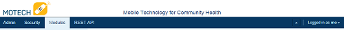
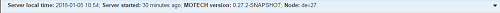

Tour of MOTECH UI
=================

The MOTECH user interface currently focuses on supporting the needs of system administrators. We will to improve this after the MOTECH 1.0 release. This document presents a tab-by-tab description of the MOTECH user interface and is best viewed while looking at the UI.

.. contents:: Table of Contents
   :depth: 3

Basic Navigation
----------------
MOTECH's header bar displays the available sections Admin, Security, Modules and REST API. The right side allows the logged in user to hide the header menu, manage their profile and choose a language in the current session.

The page footer presents information about the server including the local time, uptime, MOTECH version and node name. The down arrow on the right side allows users to hide the footer in the current session.

Tab-by-tab features
-------------------

Admin Tab
^^^^^^^^^
- Managing Modules (Manage Modules)
    Admins can install, remove, start, restart and configure modules through the user interface. Some modules expose user interfaces under the Modules tab (i.e. Commcare), but others have their configuration area embeded within this screen (i.e. OpenMRS-19). 
- Automated Email and SMS Notification (Messages)
    Admins can setup MOTECH so system administrators receive emails or SMS when errors occur in MOTECH.
- View and download the server log (Server Log)
    Admins are able to view the tomcat server log within the UI as well as manage log options to log more endpoints.

Security Tab
^^^^^^^^^^^^
- Role Based Access Controls
    Users are able to manage role based access control from the user interface.

Modules Tab
^^^^^^^^^^^
The modules tab is the location where users interact with specific modules that present a user interface. These modules are loaded under the admin tab > manage modules. Note that some modules expose underlying features that do not have a User Interface element. The following modules are present in the core platform.

Data Services
"""""""""""""
- User Defined Entities (Schema Editor > + New Entity)
    Users are able to create entities in the data base through the user interface with automatic Tasks Integration. This is commonly used to store elements from incoming sources, compile them and push them to other sources.
- User Defined Lookups (Schema Editor > Advanced > Indexes & Lookups)
    Users are able to create lookups on any entity in MOTECH that return one or many results.
- User Defined REST endpoints (Schema Editor > Advanced > REST API)
    Users are able to define REST endpoints through the user interface.
- Entity Auditing and Access Control (Schema Editor > Advanced > Auditing & revision Tracking)
    Users are able to turn on auditing and access control for any entity in data services.

Email
"""""
- Configure an email server
- Send emails through the UI
- View email logs

Scheduler
"""""""""
- View scheduler jobs

Tasks
"""""
- Create and manage tasks (note: one task can perform one action)
- View task activity and troubleshoot failed tasks

REST API Tab
^^^^^^^^^^^^
- View exposed REST API documentation created in the Data Services entities (Utilizes Swagger.io to automatically generate this documentation.)