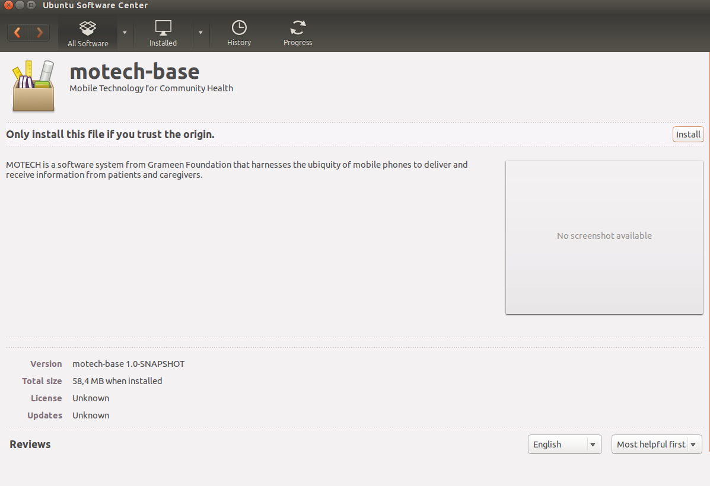

==========================
MOTECH packaging using DEB
==========================

This is a description of building process for DEB packages on Ubuntu

Requirements
============

* Apache Tomcat 7.0 or greater, can be installed with apt-get command

.. code-block:: bash

    sudo apt-get install tomcat7

* Java 1.8 or greater, can be installed with apt-get command

.. code-block:: bash

    sudo add-apt-repository ppa:webupd8team/java
    sudo apt-get update
    sudo apt-get install oracle-java8-installer

* Apache Maven 3 (needed only for building package)

Building process
================

1) move to motech project directory
2) change directory to ./packaging/deb
3) run maven command with "DEB" profile

.. code-block:: bash

    mvn clean install -PDEB

4) in the folder "./target/" should appear 2 files

- "motech_(release number)-SNAPSHOT.deb"
- "motech-base_(release number)-SNAPSHOT.deb"

Installing Motech with DEB packages
===================================

Before installation be sure that all Tomcat processes are stopped

Firstly you have to install "motech-base" package, then "motech".

You can install Motech from DEB packages in 2 ways:
- from terminal using "dpkg" command

.. code-block:: bash

    sudo dpkg -i FILE_NAME

where FILE_NAME is name of package with .deb extension you want to install

- from folder explorer by mouse double click on .deb file you want to install,
    then in the Ubuntu Software Centre window click on the "install" button

Running Motech service
======================

Before running Motech service be sure that all Tomcat processes are stopped

You can run installed Motech on default Apache Tomcat server from terminal by using "service" command

.. code-block:: bash

    sudo service motech start

Motech can now be accessed in web browser under "localhost:8080"